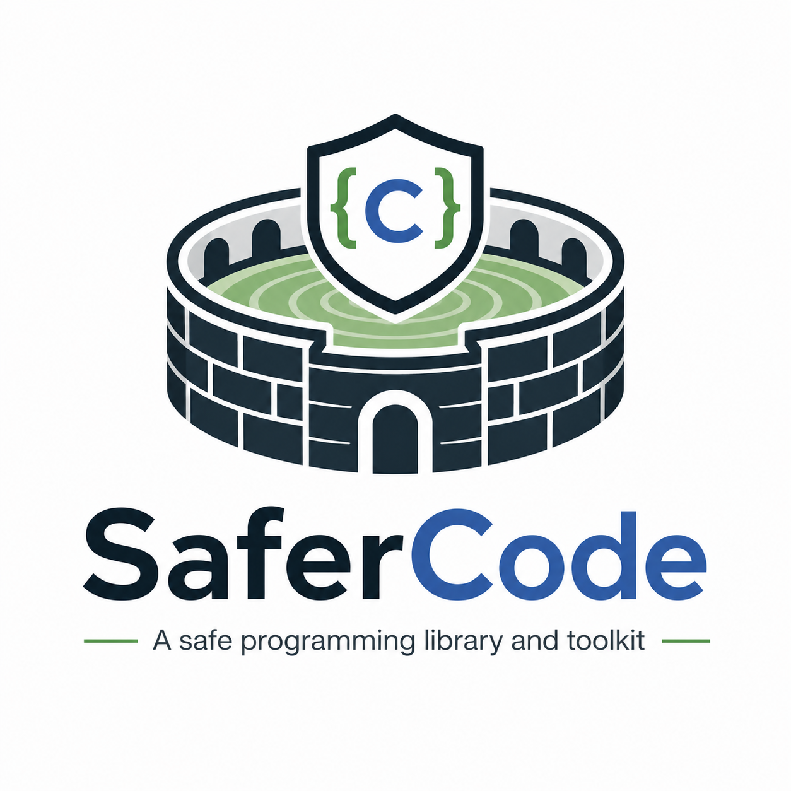

# SaferCode

<p align="center">
  
</p>

SaferCode is a header-only C library focused on practical memory-safety building blocks for real-world projects.

> ⚠️ **Experimental status**
> This project is currently experimental. APIs and behavior may change between minor releases.

## What it includes

- **Sentinel allocator** (`sc_sentinel.h`) for debug-time overflow/underflow detection
- **RAII-style cleanup helpers** (`sc_raii.h`) with safe allocation macros
- **Arena allocator** (`sc_arena.h`) for fast linear allocation patterns
- **Length-prefixed strings** (`sc_string.h`)
- **Mutable string builder** (`sc_string_builder.h`)
- **Cross-platform logging** (`sc_log.h`) with console, file, TCP, HTTP (REST-style), and fallback targets
- **Reference tracker** (`sc_reftracker.h`) to null tracked pointers on object teardown
- **Panic helper** (`sc_panic.h`)
- **Memory file abstraction** (`sc_memfile.h`) with in-memory/classic/fallback modes
- **Version helpers** (`sc_version.h`)

## Build and test

```sh
cmake -S . -B build
cmake --build build
ctest --test-dir build --output-on-failure
```

## API docs (Doxygen)

```sh
doxygen docs/Doxyfile
```

Generated HTML output is written to `build/docs/api/`.

## License

MIT — see [LICENSE](LICENSE).
